# Ôn tập giữa kỳ

## Design patterns

### Singleton

* Đảm bảo một lớp (class) chỉ có duy nhất một thực thể (instance) và cung cấp một điểm truy cập toàn cục cho
  thực thể đó. Nó thường được triển khai bằng cách sử dụng hàm khởi tạo riêng tư (private constructor) và một phương
  thức tĩnh (static) để trả về thực thể duy nhất
* Eager initialization:

```java
public class Singleton {
    // Tạo thực thể duy nhất khi lớp được load
    private static final Singleton instance = new Singleton();

    // Constructor riêng tư ngăn chặn khởi tạo từ bên ngoài
    private Singleton() {
    }

    // Phương thức tĩnh để truy cập thực thể duy nhất
    public static Singleton getInstance() {
        return instance;
    }

    public void someMethod() {
    }
}
```

* Lazy initialization:

```java
public class Singleton {
    private static Singleton instance = null;

    // Constructor riêng tư ngăn chặn khởi tạo từ bên ngoài
    private Singleton() {
    }

    // Phương thức tĩnh để truy cập thực thể duy nhất
    public static synchronized Singleton getInstance() {
        // Tạo thực thể duy nhất khi instance được yêu cầu lần đầu tiên
        if (instance == null) {
            instance = new Singleton();
        }
        return instance;
    }

    public void someMethod() {
    }
}
```

### Factory method

* Khởi tạo định nghĩa một giao diện (interface) hoặc phương thức trừu tượng (abstract method) để tạo đối tượng (object),
  nhưng để các lớp con (subclass) quyết định lớp (class) cụthể nào sẽ được khởi tạo. Mẫu này dựa vào tính kế thừa (
  inheritance) để xử lý việc khởi tạo đối tượng thay vì khởi tạo trực tiếp

```java
// Lớp trừu tượng định nghĩa các "nhà máy" con
abstract class HousePlan {
    public abstract Window createWindow();

    public abstract Door createDoor();

    public House createHouse() {
        // Sử dụng tính đa hình để tạo nhà mà không cần biết loại cửa/cửa sổ cụ thể
        return new House(createWindow(), createDoor());
    }
}

// Lớp con cụ thể quyết định đối tượng
class LuxuryHousePlan extends HousePlan {
    public Window createWindow() {
        return new LuxuryWindow();
    }

    public Door createDoor() {
        return new LuxuryDoor();
    }
}
```

### Abstract factory

* Cung cấp một giao diện (interface) để tạo ra các họ đối tượng (object) có liên quan hoặc phụ thuộc lẫn nhau mà không
  cần chỉ định các lớp cụ thể của chúng. Khác với Factory Method, nó sử dụng sự kết hợp (composition) để ủy thác trách
  nhiệm khởi tạo đối tượng cho một đối tượng khác

```java
// Giao diện cho họ sản phẩm
interface MealFactory {
    MainCourse prepareMainCourse();

    Dessert prepareDessert();
}

// Nhà máy cho họ món Âu
class WesternMealFactory implements MealFactory {
    public MainCourse prepareMainCourse() {
        return new WesternMainCourse();
    }

    public Dessert prepareDessert() {
        return new WesternDessert();
    }
}

class HousePlan {
    // Sử dụng delegation thay vì inheritance
    public House createHouse(MealFactory factory) {
        return new House(factory.prepareMainCourse(), factory.prepareDessert());
    }
}
```

### State

* Cho phép một đối tượng thay đổi hành vi của nó khi trạng thái nội bộ thay đổi, khiến đối tượng có vẻ như đã thay đổi
  lớp của chính nó. Nó đóng gói mỗi trạng thái vào một đối tượng riêng biệt để quản lý logic chuyển đổi trạng thái một
  cách rõ ràng

```java
// Context 
class Customer {
    State regularState = new Regular(this);
    State silverState = new Silver(this);
    State state = regularState; // Trạng thái ban đầu

    public void setState(State state) {
        this.state = state;
    }

    public void addMiles(int miles) {
        state.addMiles(miles); // Ủy quyền cho trạng thái xử lý
    }
}

// Lớp trạng thái trừu tượng
abstract class State {
    int awardMiles;

    public abstract void addMiles(int miles);
}

// Trạng thái cụ thể và logic chuyển đổi
class Regular extends State {
    Customer customer;

    public Regular(Customer c) {
        this.customer = c;
    }

    public void addMiles(int miles) {
        awardMiles += miles;
        if (awardMiles > 20000) customer.setState(customer.silverState); // Tự động chuyển trạng thái
    }
}
```

### Strategy

* Định nghĩa một họ các thuật toán, đóng gói từng thuật toán và cho phép chúng có thể hoán đổi cho nhau tại thời điểm
  thực thi. Nó giúp giảm độ phức tạp vòng (cyclomatic complexity) bằng cách thay thế các câu lệnh điều kiện phức tạp
  bằng các đối tượng chiến lược có thể thay đổi động

```java
// Giao diện chung cho các thuật toán
public interface StrategyInterface {
    void performStrategy();
}

// Thuật toán cụ thể 1
public class Strategy1 implements StrategyInterface {
    public void performStrategy() { /* Xử lý thuật toán 1 */ }
}

// Lớp sử dụng chiến lược
public class Context {
    private StrategyInterface strategy;

    public void setStrategy(StrategyInterface strategy) {
        this.strategy = strategy;
    }

    public void useStrategy() {
        strategy.performStrategy();
    }
}
```

### Observer

* Còn được gọi là mẫu Publish-Subscribe, định nghĩa mối quan hệ phụ thuộc một-nhiều giữa các đối tượng để khi một đối
  tượng (Subject) thay đổi trạng thái, tất cả các đối tượng phụ thuộc (Observers) sẽ được thông báo và cập nhật tự động

```java
// Giao diện người nhận tin
interface Observer {
    void update(Message msg);
}

// Giao diện chủ thể phát tin
interface Subject {
    void attach(Observer o);

    void detach(Observer o);

    void notifyUpdate();
}

class ConcreteSubject implements Subject {
    private final List<Observer> observers = new ArrayList<>(); // Danh sách người đăng ký

    public void attach(Observer o) {
        observers.add(o);
    }

    public void notifyUpdate() {
        for (Observer o : observers) o.update(new Message("Hệ thống thay đổi")); // Thông báo tất cả
    }
}
```

### Decorator

* Cho phép thêm hoặc ghi đè các hành vi bổ sung cho một đối tượng một cách linh hoạt tại thời điểm chạy mà không làm ảnh
  hưởng đến cấu trúc mã nguồn hoặc các đối tượng khác cùng lớp. Nó đạt được điều này bằng cách sử dụng các lớp bao bọc (
  wrappers) thực hiện cùng một giao diện với đối tượng được trang trí

```java
// Giao diện chung cho cả vật trang trí và vật được trang trí
interface Book {
    double cost();
}

// Đối tượng gốc 
class CustomCore implements Book {
    public double cost() {
        return 50.0;
    }
}

// Lớp trang trí
class CustomBookDecorator implements Book {
    private final Book book; // Chứa đối tượng được trang trí (composition)

    public CustomBookDecorator(Book book) {
        this.book = book;
    }

    public double cost() {
        return book.cost() + 2.0; // Thêm chi phí/hành vi mới mà không đổi cấu trúc gốc
    }
}
```

## Architecture characteristics

### Đặc tính vận hành (Operational Characteristics)

Nhóm này tập trung vào các khả năng của hệ thống khi đang hoạt động:

* **Availability**: Thời gian hệ thống cần sẵn sàng để hoạt động và khả năng phục hồi nhanh sau sự cố
* **Scalability**: Khả năng hệ thống duy trì hiệu suất khi số lượng người dùng hoặc yêu cầu tăng lên
* **Elasticity**: Khả năng hệ thống chịu đựng được các đợt tăng vọt lưu lượng truy cập đột biến
* **Reliability**: Đảm bảo hệ thống hoạt động ổn định và không bị ngắt kết nối trong quá trình tương tác
* **Performance**: Các tiêu chí về hiệu năng như thời gian phản hồi, thông lượng và dung lượng hệ thống
* **Fault Tolerance**: Khả năng hệ thống tiếp tục hoạt động ngay cả khi một thành phần gặp lỗi
* Robustness: Khả năng xử lý các lỗi và các điều kiện biên trong quá trình thực thi
* **Recoverability**: Khả năng khôi phục dữ liệu và trạng thái mong muốn sau khi gặp sự cố

### Đặc tính cấu trúc (Structural Characteristics)

Nhóm này tập trung đến chất lượng bên trong của mã nguồn và cấu trúc hệ thống:

* Configurability: Khả năng người dùng dễ dàng thay đổi các khía cạnh cấu hình của phần mềm
* Extensibility: Mức độ dễ dàng khi tích hợp thêm các thành phần hoặc chức năng mới
* **Maintainability**: Mức độ dễ dàng trong việc áp dụng các thay đổi, sửa lỗi và cải tiến hệ thống
* **Portability**: Khả năng chạy được trên nhiều nền tảng khác nhau (ví dụ: chạy trên cả Oracle và SAP DB)
* Leverageability/Reuse: Khả năng tận dụng các thành phần chung trên nhiều sản phẩm khác nhau
* Localization: Khả năng hỗ trợ đa ngôn ngữ, định dạng tiền tệ và các yêu cầu đặc thù của từng địa phương
* Upgradeability: Khả năng nâng cấp nhanh chóng và dễ dàng từ phiên bản cũ lên phiên bản mới

### Đặc tính xuyên suốt (Cross-Cutting Characteristics)

* **Security**: Bao gồm mã hóa dữ liệu, xác thực người dùng và bảo mật quyền truy cập từ xa
* Privacy: Khả năng ẩn các giao dịch đối với nhân viên nội bộ để đảm bảo tính riêng tư
* Usability: Mức độ đào tạo cần thiết để người dùng có thể sử dụng hệ thống hiệu quả
* **Agility**: Khả năng đáp ứng nhanh với thay đổi, được phân rã từ các đặc tính như Modularity, Deployability và
  Testability
* **Testability**: Khả năng kiểm thử mã nguồn và hệ thống một cách dễ dàng và đầy đủ
* **Deployability**: Mức độ dễ dàng, tần suất triển khai và rủi ro đi kèm khi đưa ứng dụng lên môi trường vận hành
* **Evolutionary**: Khả năng hệ thống có thể thay đổi cấu trúc một cách linh hoạt theo thời gian

## Architecture styles

### Monolithic

#### Layered architecture

* Tổ chức các thành phần thành các tầng logic nằm ngang (horizontal) (thường gồm: Presentation, Business, Persistence và
  Database). Mỗi tầng có vai trò cụ thể và tạo ra sự trừu tượng (abstract) đối với các tầng khác. Thường tầng trên sẽ
  biết được tầng dưới một cách trừu tượng (abstract), tầng dưới không biết được tầng trên.
  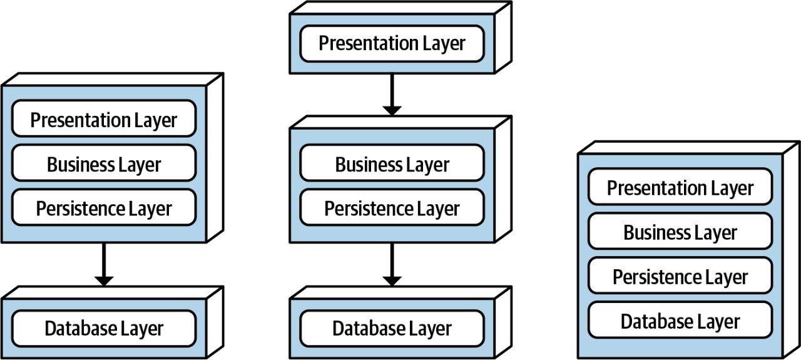
* **Ưu điểm:** Đơn giản, dễ làm quen, chi phí thấp và tách biệt các trách nhiệm kỹ thuật
* **Nhược điểm:** Khó mở rộng (scalability), khả năng linh hoạt (agility) kém, dễ gặp lỗi "sinkhole" khi yêu cầu đi qua
  nhiều tầng mà không xử lý gì
  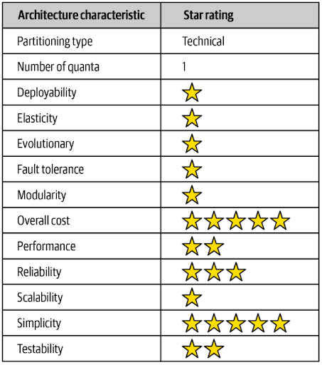

#### Pipeline architecture

* Còn được gọi là kiến trúc "Pipes and Filters", chia nhỏ chức năng thành các phần rời rạc. Các "Filter" tự vận hành và
  thực hiện một nhiệm vụ duy nhất, trong khi các "Pipe" đóng vai trò là kênh giao tiếp một chiều giữa chúng  
  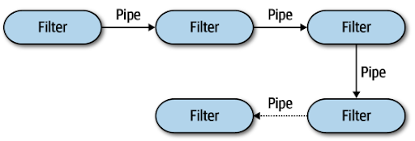
* **Ưu điểm:** Chi phí thấp, đơn giản, tính mô-đun cao nhờ tách biệt các bộ lọc (filter)
* **Nhược điểm:** Khả năng mở rộng và chịu tải (elasticity) rất thấp do tính chất đơn khối
  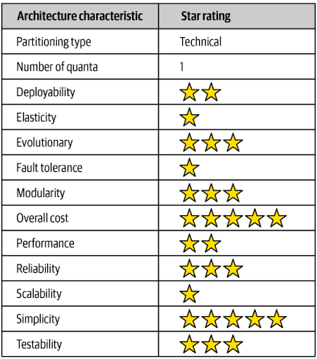

#### Microkernel architecture

* Còn gọi là kiến trúc Plug-in, gồm hai thành phần chính: một hệ thống lõi (core system) cung cấp các chức năng tối
  thiểu và các thành phần bổ trợ (plug-in) chứa các xử lý chuyên biệt để mở rộng hệ thống  
  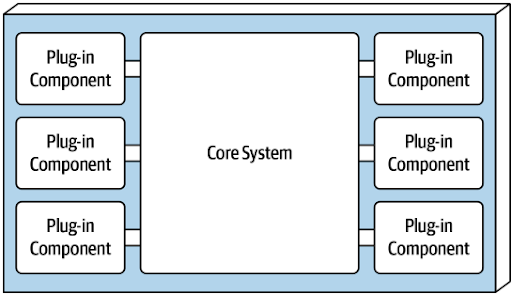
* **Ưu điểm:** Dễ mở rộng tính năng thông qua plug-in, độ linh hoạt và khả năng tùy biến cao
* **Nhược điểm:** Hệ thống lõi (core) thường là đơn khối, dẫn đến khó khăn trong việc mở rộng quy mô lớn và khả năng
  chịu lỗi kém
  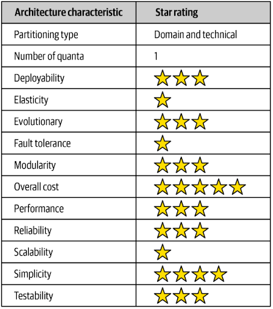

### Distributed

#### Service-based architecture

* Là sự kết hợp giữa kiến trúc đơn khối (monolithic architecture) và vi dịch vụ (microservices architecture), bao gồm
  giao diện người dùng (User interface) riêng biệt, các dịch vụ thô (coarse-grained services) được triển khai độc lập và
  một cơ sở dữ liệu đơn khối dùng chung (single central database)  
  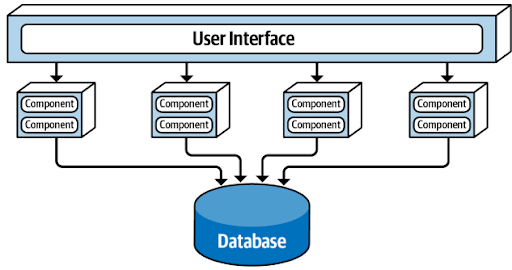
* **Ưu điểm:** Cân bằng giữa chi phí và sức mạnh, hỗ trợ tốt tính linh hoạt, kiểm thử và triển khai (deployability)
* **Nhược điểm:** Vẫn phụ thuộc vào cơ sở dữ liệu dùng chung, khả năng mở rộng không tối ưu bằng vi dịch vụ
  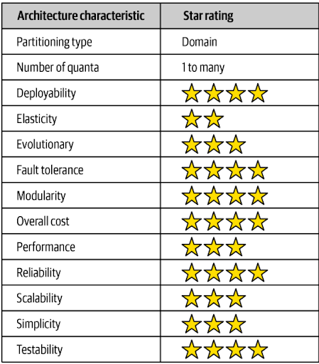

#### Event-driven architecture

* Sử dụng các sự kiện (event) để kích hoạt và giao tiếp giữa các thành phần xử lý sự kiện không đồng bộ (async) và bị
  ngắt kết nối. Kiến trúc này có hai cấu trúc chính là Broker (không có điều phối trung tâm) và Mediator (có bộ điều
  phối quy trình)
    * **Broker (Choreography)**: Các thành phần giao tiếp thông qua một trung gian (broker) để truyền và nhận các sự
      kiện, cho phép chúng hoạt động một cách độc lập và linh hoạt:  
      
    * **Mediator (Orchestration)**: Các thành phần giao tiếp thông qua một bộ điều phối (mediator) để quản lý và điều
      phối các sự kiện, tạo ra một điểm trung tâm để kiểm soát luồng sự kiện và tương tác giữa các thành phần:  
      
* **Ưu điểm:** Hiệu suất cực cao, khả năng mở rộng và chịu tải tốt, hỗ trợ các thay đổi mang tính tiến hóa
* **Nhược điểm:** Rất phức tạp để phát triển và kiểm thử, khó kiểm soát luồng xử lý và chỉ hỗ trợ tính nhất quán cuối
  cùng
  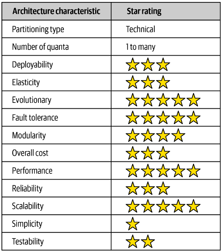

#### Space-based architecture

* Được thiết kế để giải quyết các vấn đề về khả năng mở rộng và đồng thời (concurrency) cực cao bằng cách loại bỏ cơ sở
  dữ liệu trung tâm như một nút thắt cổ chai (bottleneck), thay vào đó sử dụng các lưới dữ liệu trong bộ nhớ ( in-memory
  data grids) được sao chép  
  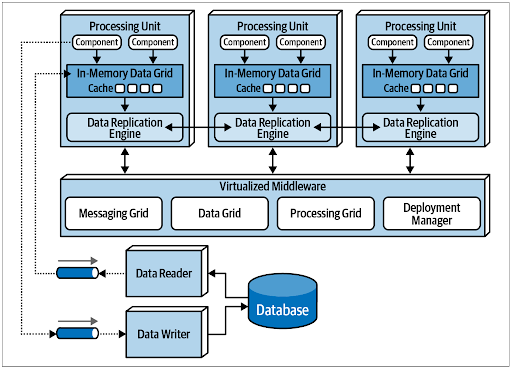
* **Ưu điểm:** Giải quyết triệt để vấn đề nút thắt cổ chai của DB, mang lại khả năng mở rộng, chịu tải và hiệu suất tối
  đa
* **Nhược điểm:** Chi phí rất cao, cực kỳ phức tạp và rất khó để kiểm thử đầy đủ các kịch bản
  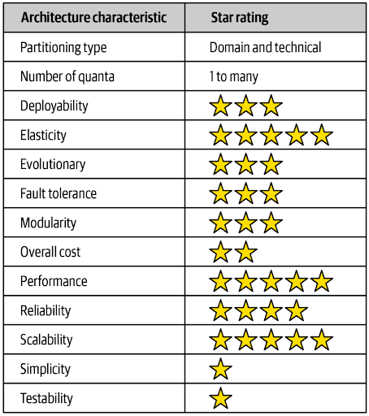

#### Service-oriented architecture

* Tập trung vào việc tái sử dụng ở cấp độ doanh nghiệp thông qua việc thiết lập một hệ thống phân loại dịch vụ (
  Business, Enterprise, Application, Infrastructure) và kết nối chúng bằng một công cụ điều phối (Orchestration Engine)
  hoặc trục dịch vụ doanh nghiệp (ESB)  
  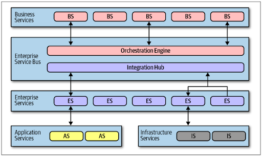
* **Ưu điểm:** Tập trung vào tái sử dụng mức doanh nghiệp, khả năng mở rộng ở mức khá
* **Nhược điểm:** Độ liên kết (coupling) quá cao do bộ điều phối trung tâm, khả năng triển khai, kiểm thử và linh hoạt
  rất thấp
  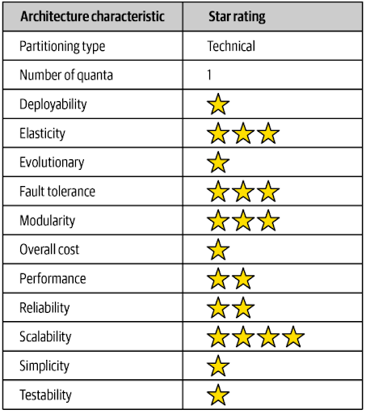

#### Microservices architecture

* Các dịch vụ được tách rời hoàn toàn, mỗi dịch vụ chạy trong quy trình riêng của nó, sở hữu cơ sở dữ liệu riêng và đại
  diện cho một phạm vi giới hạn (bounded context) cụ thể trong luồng công việc của doanh nghiệp  
  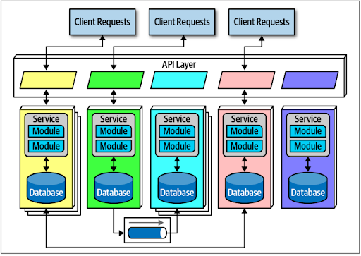
* **Ưu điểm:** Các dịch vụ tách biệt hoàn toàn, cực kỳ linh hoạt, dễ triển khai, kiểm thử và có khả năng mở rộng rất cao
* **Nhược điểm:** Chi phí triển khai và vận hành cao, hiệu suất bị ảnh hưởng do độ trễ mạng và phức tạp khi xử lý giao
  dịch phân tán
  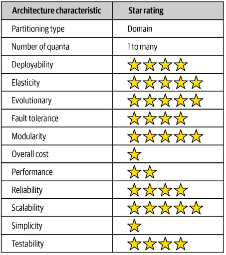


